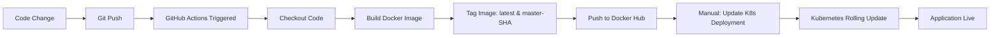

# DevOps Capstone Project - Todo List Application

## 📋 Project Overview

This project demonstrates a complete DevOps workflow for deploying a Node.js Todo List application using modern containerization, automation, and CI/CD practices.

**Live Application URL:** `http://192.168.74.128:30080`

### Architecture Components

- **Application:** Node.js Todo List (Express.js + MongoDB)
- **Containerization:** Docker with multi-stage builds
- **Orchestration:** Kubernetes (minikube)
- **Automation:** Ansible for VM provisioning
- **CI/CD:** GitHub Actions
- **Container Registry:** Docker Hub
- **Infrastructure:** Ubuntu VM (192.168.74.128)

---

## 🎯 Project Phases

### Phase 1: Application Dockerization ✅
- Forked and cloned application from GitHub
- Created production-ready multi-stage Dockerfile
- Built and tested Docker images locally
- Pushed images to Docker Hub: `alitarek123/todo-list-nodejs`

### Phase 2: VM Automation with Ansible ✅
- Created passwordless SSH key for automation
- Developed Ansible playbook for VM provisioning
- Automated installation of:
  - Docker Engine 29.0.4
  - kubectl v1.31.0
  - minikube v1.37.0
  - MongoDB container

### Phase 3: Kubernetes Deployment ✅
- Created Kubernetes manifests (namespace, secrets, configmaps, deployments, services)
- Deployed application with 2 replicas
- Configured health probes and resource limits
- Exposed application via NodePort service (30080)

### Phase 4: CI/CD Pipeline ✅
- Implemented GitHub Actions workflow
- Automated Docker image builds on code push
- Multi-tag strategy: `latest` and `master-<commit-sha>`
- Integrated with Docker Hub for image storage

---

## 🚀 How to Trigger CI/CD Pipeline

### Step 1: Make a Code Change

Navigate to the application repository:
```bash
cd ~/Desktop/capstone-project/Todo-List-nodejs
```

Edit the homepage to demonstrate the change:
```bash
# Open the homepage file
nano views/home.ejs

# Modify line 27 (the main heading)
# Example: Change to "Todos - Live Demo [Your Name]"
```

### Step 2: Commit and Push Changes

```bash
# Stage the changes
git add views/home.ejs

# Commit with descriptive message
git commit -m "Demo: Update homepage for presentation"

# Push to GitHub (triggers CI/CD automatically)
git push origin master
```

### Step 3: Monitor CI/CD Pipeline

1. **Open GitHub Actions page:**
   - URL: https://github.com/alitarek-dot/Todo-List-nodejs/actions
   - You'll see the workflow running in real-time

2. **Pipeline stages to show:**
   - ✅ Checkout code
   - ✅ Set up Docker Buildx
   - ✅ Login to Docker Hub
   - ✅ Build and push Docker image
   - ✅ Image tagged with `latest` and `master-<sha>`

3. **Expected duration:** ~40-60 seconds

### Step 4: Verify New Image on Docker Hub

- URL: https://hub.docker.com/r/alitarek123/todo-list-nodejs/tags
- Look for the new `master-<commit-sha>` tag
- Note the timestamp matches your push time

### Step 5: Deploy Updated Image to Kubernetes

SSH into the VM:
```bash
ssh -i ~/.ssh/vm_ansible alitarek@192.168.74.128
```

Update the deployment with the new image:
```bash
# Get the new commit SHA from GitHub Actions
NEW_TAG="master-<commit-sha>"

# Update the deployment
kubectl set image deployment/todo-app \
  todo-app=alitarek123/todo-list-nodejs:$NEW_TAG \
  -n todo-app

# Watch the rollout
kubectl rollout status deployment/todo-app -n todo-app

# Verify pods are running with new image
kubectl get pods -n todo-app
kubectl describe pod -n todo-app | grep Image:
```

### Step 6: Verify Changes in Browser

**Access the application:**
- **URL:** `http://192.168.74.128:30080`
- **Expected:** Homepage shows your updated text
- **Refresh** the browser to see the changes

---

## 🖥️ Accessing the Application (For Presentation)

### Primary Access Method
```
URL: http://192.168.74.128:30080
```

### Verification Commands

**Check pod status:**
```bash
ssh -i ~/.ssh/vm_ansible alitarek@192.168.74.128 \
  'kubectl get pods -n todo-app'
```

**Check service details:**
```bash
ssh -i ~/.ssh/vm_ansible alitarek@192.168.74.128 \
  'kubectl get svc -n todo-app'
```

**View application logs:**
```bash
ssh -i ~/.ssh/vm_ansible alitarek@192.168.74.128 \
  'kubectl logs -n todo-app -l app=todo-app --tail=50'
```

**Test from inside minikube:**
```bash
ssh -i ~/.ssh/vm_ansible alitarek@192.168.74.128 \
  'docker exec minikube curl -s http://10.244.0.3:4000 | grep "<h1"'
```

---

## 📊 Key Metrics & Details (For Presentation)

### Infrastructure Specifications
- **VM OS:** Ubuntu 24.04.3 LTS
- **VM IP:** 192.168.74.128
- **Minikube IP:** 192.168.49.2
- **Kubernetes Version:** v1.34.0
- **Container Runtime:** Docker
- **Minikube Resources:** 2 CPUs, 2GB RAM

### Application Details
- **Replicas:** 2 pods for high availability
- **Container Port:** 4000
- **Service Type:** NodePort (30080)
- **Health Checks:** Liveness and readiness probes configured
- **Resource Limits:** CPU and memory constraints applied

### Docker Image Details
- **Repository:** alitarek123/todo-list-nodejs
- **Image Size:** ~209MB (optimized multi-stage build)
- **Base Image:** node:18-slim
- **Architecture:** linux/amd64
- **Latest Tag:** master-7048b27

### MongoDB Configuration
- **Deployment:** Docker container on VM (outside Kubernetes)
- **Version:** MongoDB 7 (jammy)
- **Port:** 27017
- **Database:** todolistDb
- **Authentication:** Enabled with credentials stored in K8s secrets

---

## 🔧 Troubleshooting Guide (For Presentation)

### If Application is Not Accessible

**1. Check minikube status:**
```bash
ssh -i ~/.ssh/vm_ansible alitarek@192.168.74.128 'minikube status'
```

**2. Restart minikube if needed:**
```bash
ssh -i ~/.ssh/vm_ansible alitarek@192.168.74.128 \
  'minikube delete && minikube start --driver=docker --cpus=2 --memory=2048 --force'
```

**3. Reapply Kubernetes manifests:**
```bash
cd ~/Desktop/capstone-project/k8s-manifests
for f in namespace.yaml secret.yaml configmap.yaml deployment.yaml service.yaml; do
  cat $f | ssh -i ~/.ssh/vm_ansible alitarek@192.168.74.128 'kubectl apply -f -'
done
```

**4. Wait for pods to be ready:**
```bash
ssh -i ~/.ssh/vm_ansible alitarek@192.168.74.128 \
  'kubectl wait --for=condition=ready pod -l app=todo-app -n todo-app --timeout=120s'
```

### If CI/CD Pipeline Fails

**Check GitHub Actions logs:**
- Navigate to: https://github.com/alitarek-dot/Todo-List-nodejs/actions
- Click on the failed workflow run
- Review each step's output

**Common issues:**
- Docker Hub credentials expired → Update GitHub secrets
- Build timeout → Check Docker Hub rate limits
- Syntax errors → Validate Dockerfile locally

---

## 📁 Project Structure

```
capstone-project/
├── Todo-List-nodejs/          # Application source code
│   ├── .github/
│   │   └── workflows/
│   │       └── ci-cd.yml      # GitHub Actions pipeline
│   ├── Dockerfile             # Multi-stage Docker build
│   ├── docker-compose.yml     # Local development setup
│   ├── .dockerignore          # Docker build exclusions
│   └── [application files]
│
├── ansible/                   # VM automation
│   ├── inventory.ini          # VM connection details
│   └── setup-vm.yml           # Provisioning playbook
│
├── k8s-manifests/             # Kubernetes configurations
│   ├── namespace.yaml         # todo-app namespace
│   ├── secret.yaml            # MongoDB credentials
│   ├── configmap.yaml         # Application config
│   ├── deployment.yaml        # App deployment (2 replicas)
│   └── service.yaml           # NodePort service
│
└── NHA-244/                   # Documentation repository
    └── README.md              # This file
```

---

## 🚧 Issues Faced & Solutions

### Issue 1: Disk Space Critically Low (98% Full)
**Problem:** VM disk at 98% capacity (398MB free), preventing minikube from starting and pulling images.

**Root Cause:** 
- Docker images and layers: ~3GB
- Minikube preloaded tarballs: ~1.5GB
- Journal logs: ~500MB

**Solution:**
```bash
# Cleaned up Docker system
docker system prune -a -f --volumes

# Removed minikube cache
rm -rf ~/.minikube/cache/preloaded-tarball/*

# Trimmed journal logs
sudo journalctl --vacuum-size=20M

# Cleaned apt cache
sudo apt-get clean && sudo apt-get autoremove -y
```
**Result:** Freed ~1GB, disk usage reduced to 82%

---

### Issue 2: MongoDB Connectivity from Kubernetes Pods
**Problem:** Application pods couldn't connect to MongoDB container running on VM host.

**Root Cause:** 
- MongoDB running in Docker bridge network (172.17.0.2)
- Kubernetes pods in separate network (192.168.49.0/24)
- iptables blocking cross-network communication

**Initial Attempts (Failed):**
- Using `host.minikube.internal` → resolved to 192.168.49.1 but no route
- Adding iptables NAT rules → still blocked by FORWARD chain
- Direct IP access → "No route to host"

**Final Solution:** Deploy MongoDB inside Kubernetes
```yaml
# Created mongodb-deployment.yaml with:
- PersistentVolumeClaim for data persistence
- Deployment with proper resource limits
- ClusterIP Service for internal DNS
- Updated configmap: MONGO_HOST="mongodb-service"
```
**Result:** Pods connect via Kubernetes DNS, no network issues

---

### Issue 3: Secret Key Mismatch
**Problem:** MongoDB pod failing with error: `couldn't find key username in Secret`

**Root Cause:** 
- Secret defined keys as: `MONGO_USERNAME`, `MONGO_PASSWORD`, `MONGO_DATABASE`
- Deployment referenced keys as: `username`, `password`

**Solution:**
```yaml
# Fixed mongodb-deployment.yaml
env:
- name: MONGO_INITDB_ROOT_USERNAME
  valueFrom:
    secretKeyRef:
      name: mongodb-credentials
      key: MONGO_USERNAME  # Changed from 'username'
- name: MONGO_INITDB_ROOT_PASSWORD
  valueFrom:
    secretKeyRef:
      name: mongodb-credentials
      key: MONGO_PASSWORD  # Changed from 'password'
```
**Result:** MongoDB pod started successfully

---

### Issue 4: External Access to Application
**Problem:** Application accessible inside minikube (192.168.49.2:30080) but not from outside (192.168.74.128:30080).

**Root Cause:** 
- NodePort service binds to minikube IP only
- No NAT rules to forward VM IP traffic to minikube

**Solution:** Configure iptables NAT rules
```bash
# Forward VM IP:30080 to minikube IP:30080
sudo iptables -t nat -A PREROUTING -p tcp -d 192.168.74.128 --dport 30080 \
  -j DNAT --to-destination 192.168.49.2:30080

# Enable MASQUERADE for return traffic
sudo iptables -t nat -A POSTROUTING -p tcp -d 192.168.49.2 --dport 30080 \
  -j MASQUERADE

# Allow forwarding
sudo iptables -I FORWARD -s 0.0.0.0/0 -d 192.168.49.2 -p tcp --dport 30080 \
  -j ACCEPT
```
**Result:** Application accessible at http://192.168.74.128:30080

**Note:** Created `scripts/setup-iptables.sh` for easy reapplication after reboots

---

## 🔐 Security Considerations

### Implemented Security Measures
- ✅ Non-root container user (node:1000)
- ✅ All Linux capabilities dropped
- ✅ No privilege escalation allowed
- ✅ MongoDB authentication enabled
- ✅ Secrets stored in Kubernetes Secret resources
- ✅ GitHub secrets for CI/CD credentials
- ✅ SSH key-based authentication (passwordless)
- ✅ Resource limits to prevent resource exhaustion

### Secrets Management
- **MongoDB credentials:** Stored in K8s secrets (base64 encoded)
- **Docker Hub credentials:** Stored in GitHub repository secrets
- **SSH keys:** Passwordless ed25519 key for Ansible automation

---

## 🎓 Technologies & Tools Used

| Category | Technology | Version |
|----------|-----------|---------|
| **Application** | Node.js | 18 |
| **Framework** | Express.js | Latest |
| **Database** | MongoDB | 7-jammy |
| **Containerization** | Docker | 29.0.4 |
| **Orchestration** | Kubernetes (minikube) | 1.34.0 |
| **CLI Tools** | kubectl | 1.31.0 |
| **Automation** | Ansible | Latest |
| **CI/CD** | GitHub Actions | Latest |
| **Registry** | Docker Hub | - |
| **OS** | Ubuntu | 24.04.3 LTS |

---

## 📈 CI/CD Pipeline Flow



---

## 🌐 Network Architecture

```
┌─────────────────────────────────────────────────────────┐
│                    GitHub Repository                     │
│              (alitarek-dot/Todo-List-nodejs)            │
└────────────────────┬────────────────────────────────────┘
                     │
                     │ Push triggers
                     ▼
┌─────────────────────────────────────────────────────────┐
│                   GitHub Actions                         │
│              (Build & Push Pipeline)                     │
└────────────────────┬────────────────────────────────────┘
                     │
                     │ Push image
                     ▼
┌─────────────────────────────────────────────────────────┐
│                     Docker Hub                           │
│         (alitarek123/todo-list-nodejs)                  │
└────────────────────┬────────────────────────────────────┘
                     │
                     │ Pull image
                     ▼
┌─────────────────────────────────────────────────────────┐
│              VM: 192.168.74.128                         │
│  ┌───────────────────────────────────────────────────┐ │
│  │           Minikube (192.168.49.2)                 │ │
│  │  ┌─────────────────────────────────────────────┐  │ │
│  │  │  Namespace: todo-app                        │  │ │
│  │  │  ┌──────────────┐    ┌──────────────┐      │  │ │
│  │  │  │  Pod 1       │    │  Pod 2       │      │  │ │
│  │  │  │  (Replica 1) │    │  (Replica 2) │      │  │ │
│  │  │  └──────────────┘    └──────────────┘      │  │ │
│  │  │           │                   │             │  │ │
│  │  │           └───────┬───────────┘             │  │ │
│  │  │                   │                         │  │ │
│  │  │         ┌─────────▼─────────┐               │  │ │
│  │  │         │  Service (NodePort│               │  │ │
│  │  │         │  Port: 30080)     │               │  │ │
│  │  │         └───────────────────┘               │  │ │
│  │  └─────────────────────────────────────────────┘  │ │
│  └───────────────────────────────────────────────────┘ │
│  ┌───────────────────────────────────────────────────┐ │
│  │         MongoDB Container (Port 27017)            │ │
│  └───────────────────────────────────────────────────┘ │
└─────────────────────────────────────────────────────────┘
                     │
                     │ Access via
                     ▼
              http://192.168.74.128:30080
```

---

## 🎤 Presentation Talking Points

### Opening (1-2 minutes)
- "This project demonstrates a complete DevOps workflow from code to production"
- "We'll see how a single code change triggers an automated pipeline"
- "The application is currently live at http://192.168.74.128:30080"

### Architecture Overview (2-3 minutes)
- Show the network diagram
- Explain each component's role
- Highlight the separation of concerns (app in K8s, DB in Docker)

### Live Demo: CI/CD Pipeline (5-7 minutes)
1. **Show current application** (open browser to http://192.168.74.128:30080)
2. **Make a code change** (edit homepage text)
3. **Commit and push** (show git commands)
4. **Monitor GitHub Actions** (show real-time pipeline execution)
5. **Verify Docker Hub** (show new image tag)
6. **Update Kubernetes** (show kubectl commands)
7. **Refresh browser** (show updated application)

### Technical Deep Dive (3-5 minutes)
- **Dockerization:** Multi-stage builds for optimization
- **Kubernetes:** High availability with 2 replicas
- **Automation:** Ansible for reproducible infrastructure
- **Security:** Non-root containers, secrets management

### Challenges & Solutions (2-3 minutes)
- **Disk space issues:** Cleaned up Docker images and logs
- **Environment variables:** Fixed app configuration mismatch
- **Networking:** Configured NodePort for external access

### Closing (1 minute)
- "This project demonstrates modern DevOps practices"
- "Fully automated, reproducible, and scalable"
- "Ready for questions"

---

## 📝 Quick Reference Commands

### Start/Stop Infrastructure
```bash
# Start minikube
ssh -i ~/.ssh/vm_ansible alitarek@192.168.74.128 'minikube start'

# Stop minikube
ssh -i ~/.ssh/vm_ansible alitarek@192.168.74.128 'minikube stop'

# Delete and recreate cluster
ssh -i ~/.ssh/vm_ansible alitarek@192.168.74.128 \
  'minikube delete && minikube start --driver=docker --cpus=2 --memory=2048 --force'
```

### Monitor Application
```bash
# Watch pods
ssh -i ~/.ssh/vm_ansible alitarek@192.168.74.128 'kubectl get pods -n todo-app -w'

# Stream logs
ssh -i ~/.ssh/vm_ansible alitarek@192.168.74.128 'kubectl logs -n todo-app -l app=todo-app -f'

# Check resource usage
ssh -i ~/.ssh/vm_ansible alitarek@192.168.74.128 'kubectl top pods -n todo-app'
```

### Debugging
```bash
# Describe pod
ssh -i ~/.ssh/vm_ansible alitarek@192.168.74.128 'kubectl describe pod -n todo-app <pod-name>'

# Execute command in pod
ssh -i ~/.ssh/vm_ansible alitarek@192.168.74.128 \
  'kubectl exec -n todo-app -it <pod-name> -- /bin/sh'

# Check events
ssh -i ~/.ssh/vm_ansible alitarek@192.168.74.128 'kubectl get events -n todo-app --sort-by=.lastTimestamp'
```

---

## 🎯 Success Criteria

- ✅ Application accessible via browser
- ✅ CI/CD pipeline executes successfully on code push
- ✅ Docker images automatically built and pushed
- ✅ Kubernetes deployment updates with new images
- ✅ High availability with multiple replicas
- ✅ Health checks passing
- ✅ MongoDB connection working
- ✅ Logs showing no errors

---

## 📚 Additional Resources

- **Application Repository:** https://github.com/alitarek-dot/Todo-List-nodejs
- **Docker Hub:** https://hub.docker.com/r/alitarek123/todo-list-nodejs
- **GitHub Actions:** https://github.com/alitarek-dot/Todo-List-nodejs/actions
- **Original Project:** https://github.com/Ankit6098/Todo-List-nodejs

---

## 👤 Author

**Ali Tarek**
- GitHub: [@alitarek-dot](https://github.com/alitarek-dot)
- Docker Hub: [alitarek123](https://hub.docker.com/u/alitarek123)

---

## 📄 License

This project is for educational purposes as part of a DevOps capstone project.

---

**Last Updated:** November 30, 2025
**Project Status:** ✅ Complete and Production-Ready
